# Automated YouTube Subscription Copier
> 유튜브 프리미엄 유목민으로서 <br/> 약 180일 마다 신규 계정을 생성/이관해야하므로 <br/>
구 계정의 구독 목록을 신규 계정에 일괄 등록하기 위함.

# TODO
- <s>도커 컨테이너로 구동하도록.</s>
- 유튜브 뮤직도?

## 참고
- [OPEN API 사용량 제한](https://developers.google.com/youtube/v3/determine_quota_cost?hl=ko)
- [유튜브 뮤직 재생목록 용도?](https://developers.google.com/youtube/v3/docs/playlists?hl=ko)

## requirements
1. google cloud registration
2. 둘중 하나 선택
    - golang
    ```bash
        $ go version
        go version go1.23.0 darwin/arm64
    ```
    - docker
    ```bash
        $ docker version
        Server: Docker Desktop 4.26.1 (131620)
        Engine:
        Version:          24.0.7
    ```


## Steps
### 복제할 유튜브 계정의 채널 아이디 정보를 `.env`파일에 기입해주세요.
```bash
touch .env
```
```.env
TARGET_CHANNEL_ID="PASTE_TARGET_CHANNEL_ID"
```
1~7 단계 참고 [공식_문서](https://developers.google.com/youtube/v3/quickstart/go?hl=ko#step_1_turn_on_the)
1. 채널의 구독 정보 비공개를 해제해주세요.<br/>
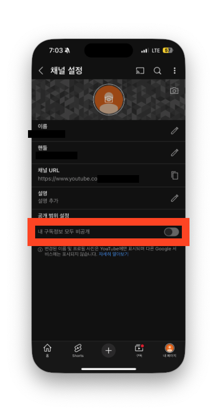
2. 구글 클라우드 콘솔로 이동해주세요. [google-cloud-console](https://console.cloud.google.com/welcome?hl=ko&inv=1&invt=Ab0cDg)
3. 신규 프로젝트 생성 
4. 신규로 리소스를 생성해주세요. 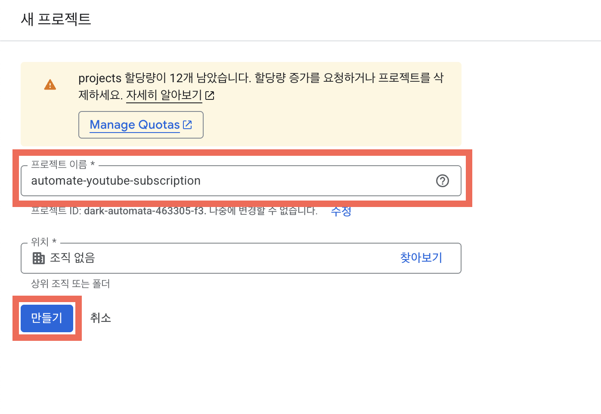
5. Oauth2 client를 생성해주세요.(구독 요청시 이용)

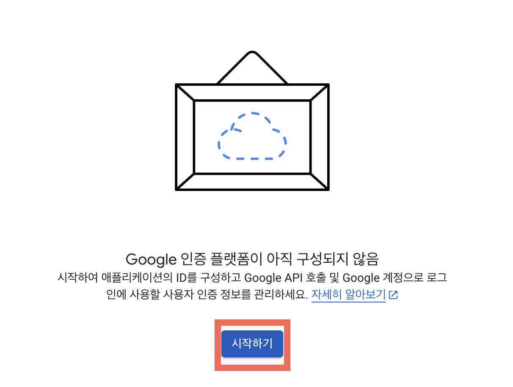
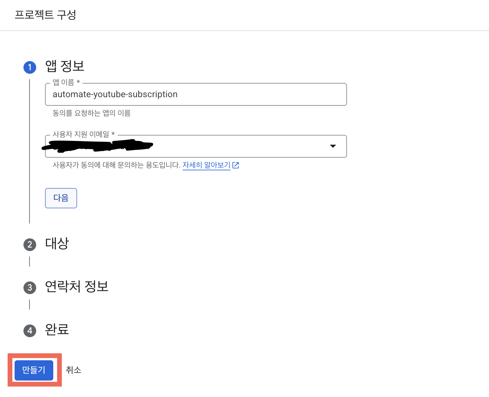
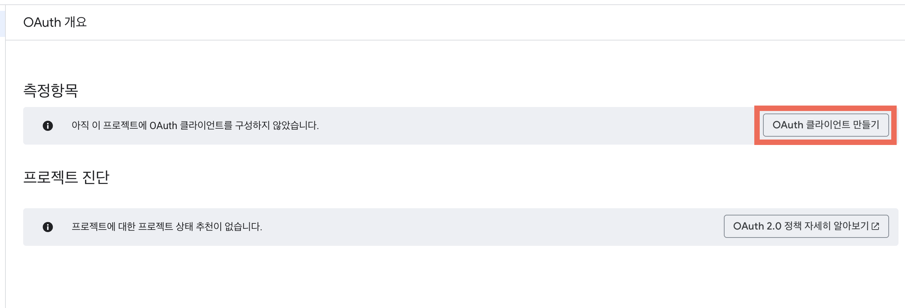
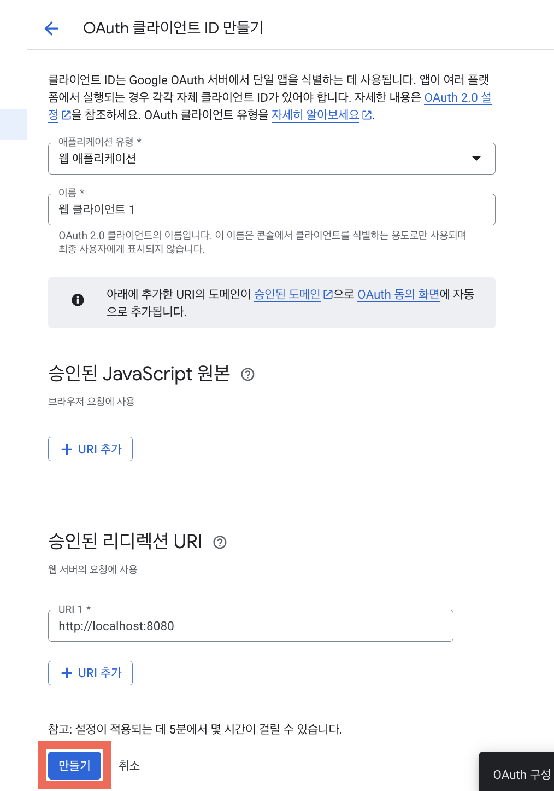
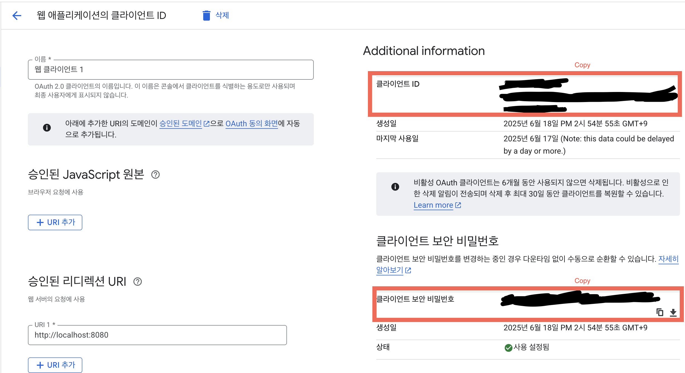
중요 개인 정보를 `.env`파일에 기입해주세요.
```.env
GOOGLE_CLIENT_ID="PASTE_YOUR_CLIENT_ID"
GOOGLE_CLIENT_SECRET="PASTE_YOUR_CLIENT_SECRET"
REDIRECT_URL="http://localhost:8080"
```
6. API Key를 생성해주세요.(구독 목록 조회시 이용)
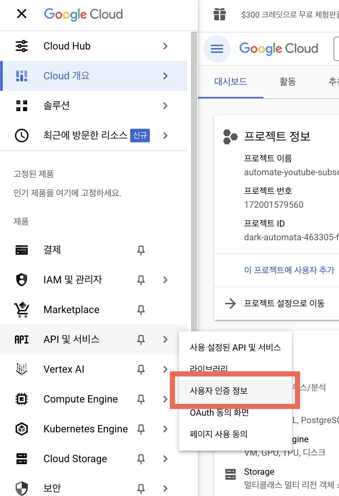
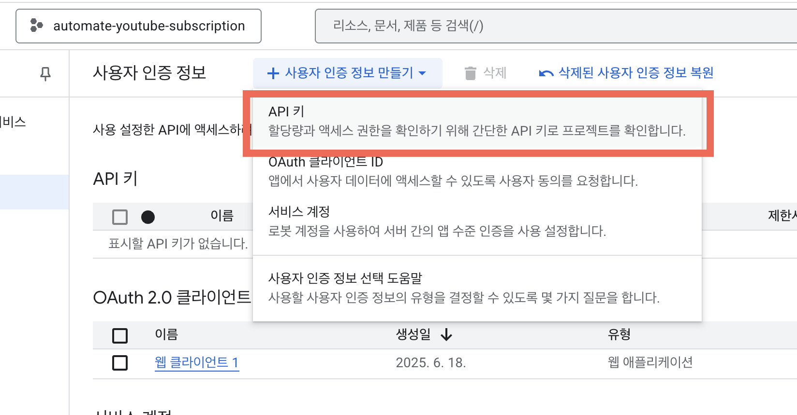
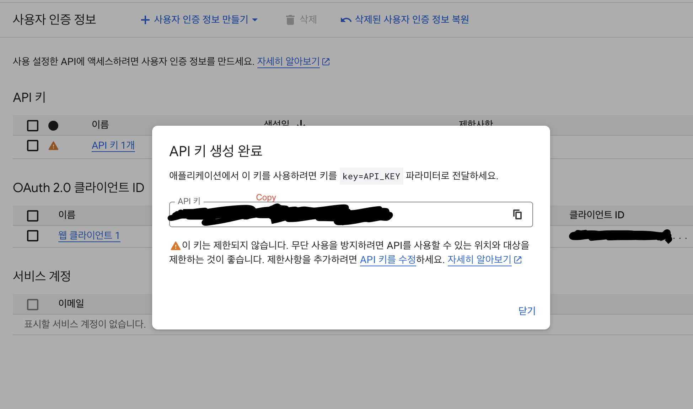
save private informations to file `.env`
```.env
GOOGLE_API_KEY="PASTE_YOUR_API_KEY"
```
6-1. youtube data api v3 사용 등록
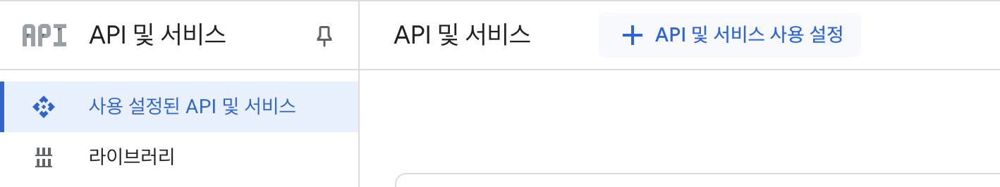
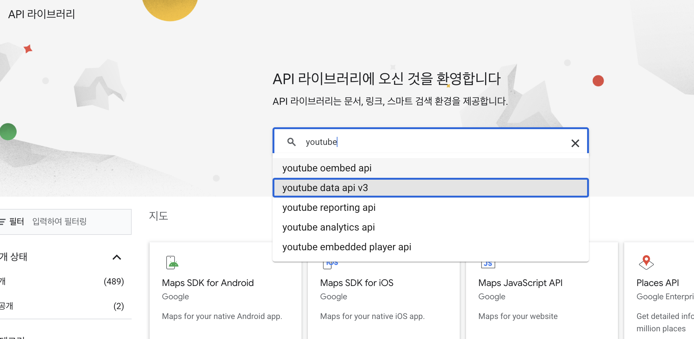
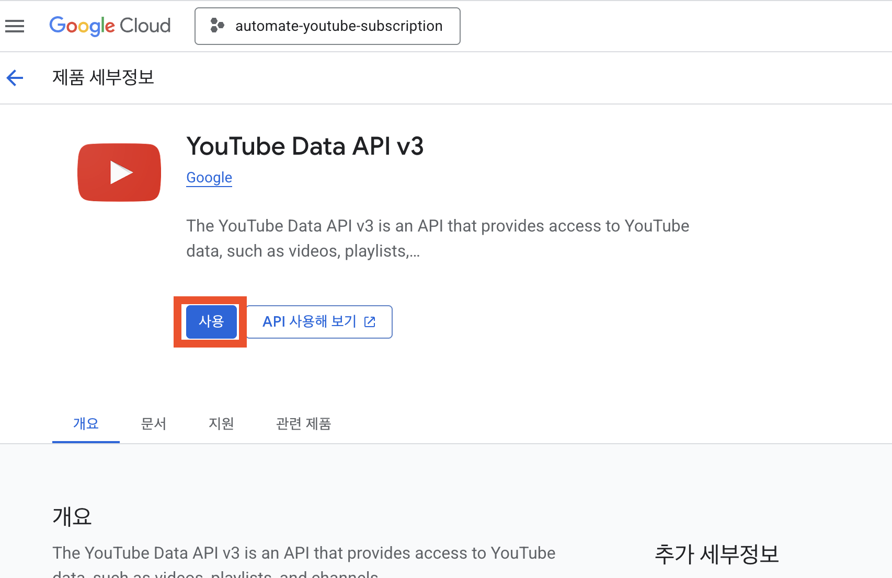
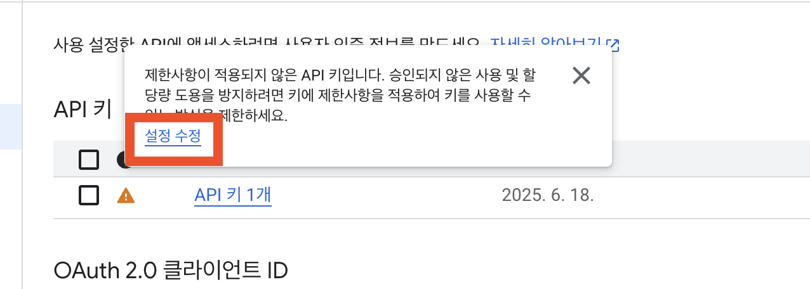
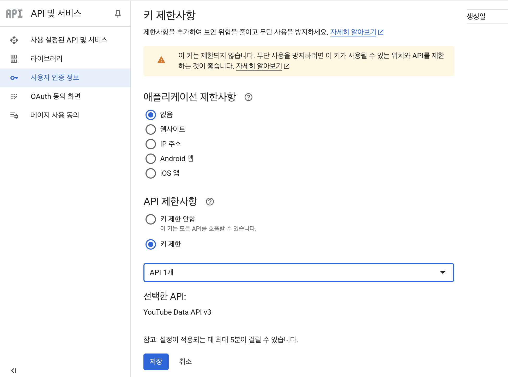
7. 테스트 용 사용자 추가(oauth 인증시 필요)
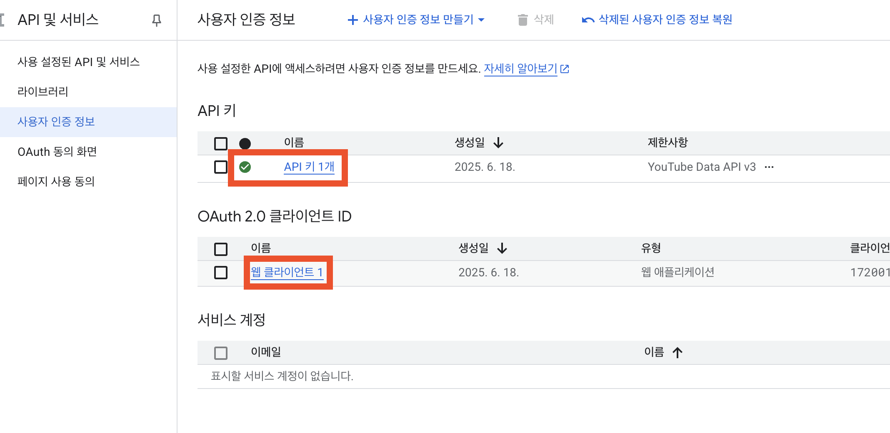
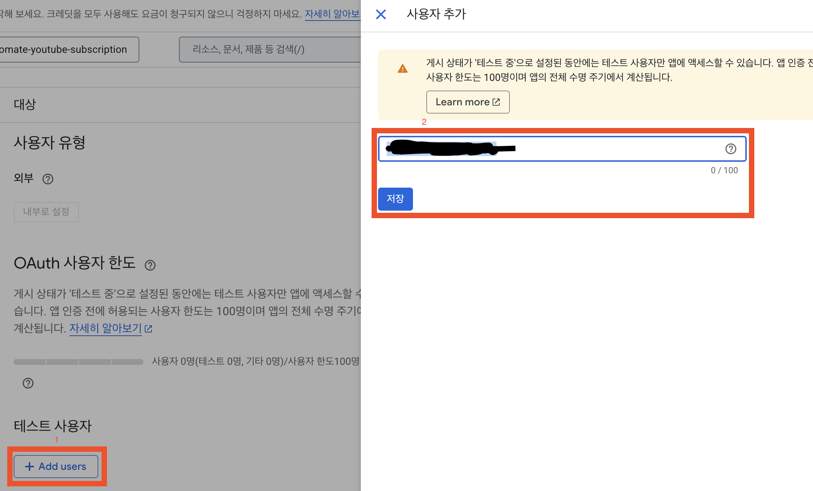
8. 실행
- 도커로 실행
```bash
# 도커 빌드
$ docker buildx build --platform linux/amd64 -t automate_youtube_subscription -f internal/deployments/Dockerfile .
# 컨테이너 실행
$ docker run --rm -p 8080:8080 --name automate_youtube_subscription automate_youtube_subscription
```
- 직접 실행
```bash
$ go run cmd/automate_youtube_subscription/main.go
```
### output
```bash
GOOGLE_CLIENT_ID: XXXX....
GOOGLE_CLIENT_SECRET: XXXX....
REDIRECT_URL: http://localhost:8080
GOOGLE_API_KEY: XXXX....
TARGET_CHANNEL_ID: XXXX....

- 재생 목록: 🔥 (ID:XXXXXX)
- 재생 목록 항목: Make U Dance (Feat. Jay Park) (박재범) (& Paul Blanco) (ID:4DZRLuD8AMs)
- 재생 목록 항목: Crack On My Screen (내핸드폰에금이갔네) (Prod. By Minit) (Feat. Paloalto) (ID:kgNiM2u9OHQ)
- 재생 목록 항목: [MV] Just Music _ Carnival Gang(카니발갱) (ID:CJdOUxMAkME)
....
playListId:XYYYY, playListTitle:🔥, len(playListItems):10
playlist is already exist. 복제된_🔥
이미 있는 재생목록 아이템(4DZRLuD8AMs)
이미 있는 재생목록 아이템(kgNiM2u9OHQ)
.....
playlist item is newly appended [MV] Just Music _ Carnival Gang(카니발갱)
.....

==	채널아이디(XXX)의 YouTube 구독 목록	==
- 채널 제목: Noel Deyzel (ID: UCMp-0bU-PA7BNNR-zIvEydA)
.....

==	내 채널의 YouTube 구독 목록	==
- 채널 제목: acooknamedMatt (ID: UCYjJeNVpgjAz-Sv4dhs13VQ)
.....

[willbe] retrieved subcribed channel size(85)
[current] subcribed channel size(84)
-> removed duplicated channel. left channel count:
구독 성공: Noel Deyzel
[request] UCMp-0bU-PA7BNNR-zIvEydA registered
%
......
```

